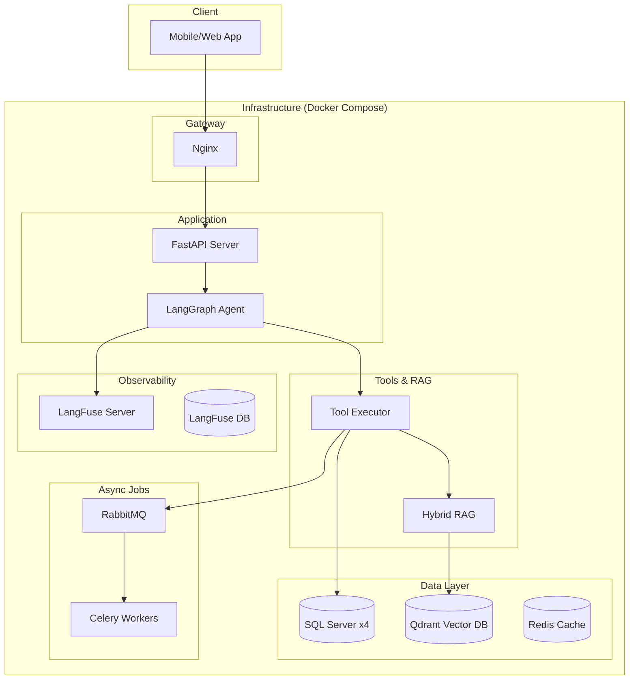

# 🏗️ TBot V2 Architecture

## System Overview



---

## Component Details

### 1. LangGraph Agent (New)

**Responsibility**: Stateful orchestration of conversation flow.

```python
# State Definition
class AgentState(TypedDict):
    messages: Annotated[List[BaseMessage], operator.add]
    context: Dict[str, Any]

# Graph Flow
chatbot_node -> (decision) -> tools_node
     ↑                            │
     └────────────────────────────┘
```

**Key Benefits vs V1:**
- **State Management**: Built-in memory handling via `checkpointer`.
- **Cyclic Graph**: Better handle multi-turn reasoning loops.
- **Observability**: `LangFuse` integration for deep tracing.

### 2. Observability (LangFuse)

**Responsibility**: Monitor agent performance and debug traces.

- **Tracing**: Track full execution path (Input → LLM → Tool → Output).
- **Scores**: Rate responses (thumbs up/down).
- **Cost**: Track token usage & latency.


**Why Function Calling > Template Matching?**

| Aspect | Template Matching (V1) | Function Calling (V2) |
|--------|------------------------|----------------------|
| Flexibility | Fixed 4 templates | LLM chooses dynamically |
| Multi-step | Not supported | Supported (agent loop) |
| Error handling | Hardcoded fallback | LLM can retry/adapt |
| New features | Add template manually | Just add new tool |

---

### 2. ToolExecutor

**Responsibility**: Execute tools and manage data access.

```python
class ToolExecutor:
    registry = {
        "get_place_info": _get_place_info,
        "get_place_location": _get_place_location,
        "get_place_media": _get_place_media,
        "get_attractions": _get_attractions,
        "search_places": _search_places,  # Uses Qdrant
    }
    
    async def execute(self, tool_name: str, args: dict, context: dict):
        """
        Context contains:
        - region_id (0-3): Which database to query
        - project_id: Filter within database
        - user_location: Optional GPS coords
        """
```

**Tool Specifications**:

| Tool | Input | Output | Data Source |
|------|-------|--------|-------------|
| `get_place_info` | place_name, info_type | name, introduction | SQL |
| `get_place_location` | place_name | location, coordinates | SQL |
| `get_place_media` | place_name | video_urls, audio_urls | SQL |
| `get_attractions` | place_name | list of attractions | SQL |
| `search_places` | query, top_k | matched places | Qdrant |

---

### 3. Hybrid RAG (Qdrant)

**Responsibility**: Vector search fallback when SQL doesn't match.

```
Query: "có gì hay ở Đà Nẵng?"
              ↓
    ┌─────────────────┐
    │ SQL Exact Match │ → No results
    └────────┬────────┘
             ↓
    ┌─────────────────┐
    │ Qdrant Vector   │ → Found: "Bà Nà Hills", "Ngũ Hành Sơn"
    │ Search          │
    └────────┬────────┘
             ↓
    Return top-k results
```

**Collection Schema**:

```json
{
  "name": "travel_knowledge",
  "vectors": {
    "size": 384,
    "distance": "Cosine"
  },
  "payload": {
    "region_id": "integer",
    "project_id": "integer",
    "name": "string",
    "text": "string"
  }
}
```

---

### 4. Async Layer

**Responsibility**: Handle non-blocking background tasks.

```
FastAPI                    RabbitMQ                 Celery Worker
   │                          │                          │
   │──── TTS Request ────────▶│                          │
   │◀─── Task ID ─────────────│                          │
   │                          │──── Dispatch ──────────▶│
   │                          │                          │
   │                          │                          │──── Generate Audio
   │                          │                          │──── Upload to GCS
   │                          │                          │
   │                          │◀─── Result ─────────────│
   │──── Poll Result ────────▶│                          │
   │◀─── Audio URL ───────────│                          │
```

**Background Tasks**:

| Task | Trigger | Action |
|------|---------|--------|
| `generate_tts` | /tts endpoint | Edge TTS → GCS upload |
| `sync_vectors` | Scheduled/Manual | SQL → Qdrant sync |
| `send_notification` | Geo-fence trigger | Firebase push |
| `log_analytics` | Each request | Log to database |

---

## Data Flow Example

**User asks**: "Bà Nà Hills có gì vui?"

```
1. FastAPI receives request
   { text: "Bà Nà Hills có gì vui?", region_id: 0, project_id: 1 }

2. TravelAgent.run() called
   - Sends to Ollama with tool definitions
   - LLM returns: tool_call("get_attractions", {place_name: "Bà Nà Hills"})

3. ToolExecutor.execute()
   - Queries SQL: SELECT * FROM SubProjectAttractions WHERE ...
   - Returns: [{"name": "Cầu Vàng"}, {"name": "Fantasy Park"}]

4. TravelAgent loop continues
   - Sends results back to LLM
   - LLM synthesizes: "Bà Nà Hills có nhiều điểm vui..."

5. Response returned to user
```

---

## Database Schema (Multi-Region)

```
Region 0: guidepass_guidepassasia_cloud
Region 1: gui18554_guidepass
Region 2: guidepass_cityguidepass_cloud
Region 3: propass_proguidepass

Each database has:
├── SubProjects
│   ├── SubProjectID
│   ├── SubProjectName
│   ├── Introduction
│   ├── Location
│   └── ProjectID
├── SubProjectAttractions
│   ├── SubProjectAttractionID
│   ├── AttractionName
│   ├── Introduction
│   └── SubProjectID (FK)
└── SubProjectAttractionMedia
    ├── MediaType (video/audio)
    ├── MediaURL
    └── SubProjectAttractionID (FK)
```

---

## Docker Services

```yaml
services:
  fastapi:      # Main API server
  nginx:        # Reverse proxy
  ollama:       # LLM inference
  qdrant:       # Vector database
  redis:        # Cache + result backend
  rabbitmq:     # Message broker
  celery_worker: # Background tasks
```

See `docker-compose.yml` for full configuration.
